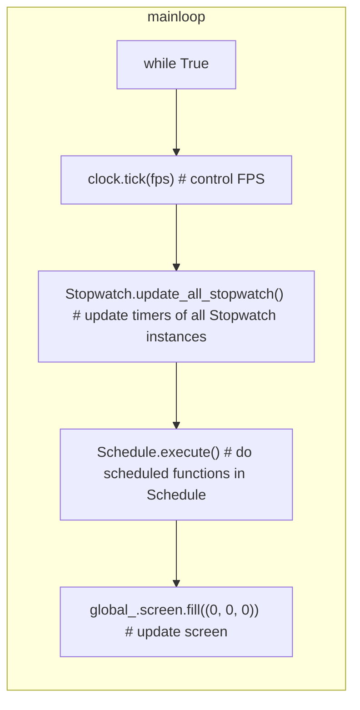

# WIP

```mermaid
graph RL
    subgraph "mainloop" 
        A["while True"]
        B["clock.tick(fps) # control FPS"]
        C["Stopwatch.update_all_stopwatch() # update timers of all Stopwatch instances"]
        D["Schedule.execute() # do scheduled functions in Schedule"]
        E["global_.screen.fill((0, 0, 0)) # update screen"]
        A-->B
        B-->C
        C-->D
        D-->E
    end
```
